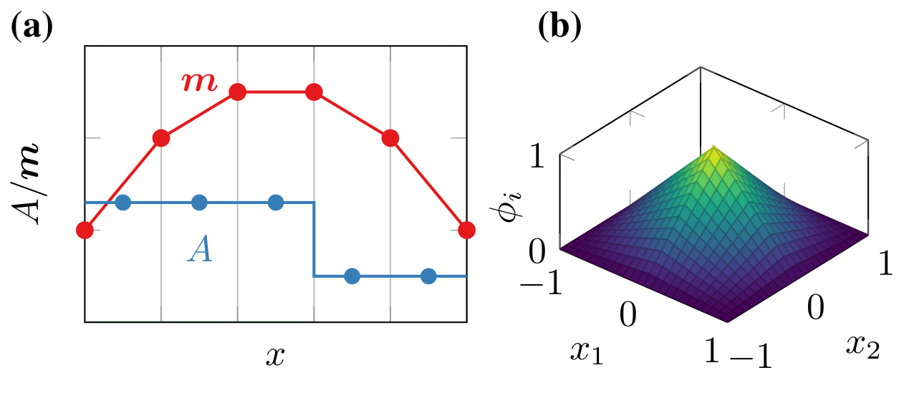

Nodal Finite-Differences
========================

The nodal finite-difference scheme applies a finite-element approach on a regular cuboidal grid for local field contributions such as the exchange field.
This allows the use of a continuous, piecewise polynomial function space for fields such as the magnetization :math:`\vec{m}` and a piecewise constant function space for material parameters such as the exchange constant :math:`A`, see :numref:`nodal_fd` (a).
For the continuous field, we use product-space 1D-Lagrange (trilinear) basis functions :math:`\phi_i`, see exemplary 2D representation in :numref:`nodal_fd` (b).

For the field computation, we apply the finite-element formalism with mass lumping according to [Abert2019]_, i.e.

.. math::

  H_i &= \sum_j A_{ij} m_j,\\
  A_{ij} &=
  - \left[ \int_{\Omega_\text{m}} \mu_0 M_\text{s} \vec{\phi}_i \cdot \vec{1} \dx \right]^{-1}
  \delta E(\vec{m} = \vec{\phi}_j; \vec{\phi}_i)

with :math:`H_i` and :math:`m_i` being the vectors carrying the :math:`3N` coefficients of the discretized field :math:`\vec{H}` and magnetization :math:`\vec{m}`  respectively and :math:`\delta E(\vec{m} = \vec{\phi}_j; \vec{\phi}_i)` being the functional differential of the Gibbs free energy :math:`E` in the direction :math:`\vec{\phi}_i` evaluated at :math:`\vec{m} = \vec{\phi}_j`.
In case of a quadratic energy contribution such as the exchange field, the operator :math:`A_{ij}` is a constant matrix

.. math::

  A_{ij} =
  - \left[ \int_{\Omega_\text{m}} \mu_0 M_\text{s} \vec{\phi}_i \cdot \vec{1} \dx \right]^{-1}
  A_\text{ex} \nabla \vec{\phi}_i : \nabla \vec{\phi}_j \dx.

Since we apply the finite-element method on a regular grid, the matrix :math:`A` has a regular structure and is fully characterized by the element matrix for a single discretization cell.
Due to this structure, the nodal discretization can be trivially implemented as a matrix-free method with no significant memory nor performance overhead compared to the standard finite-difference methodology.

  Nodal finite-difference discretization.
  (a) 1D representation of discretization for continuous field (red) and piecewise constant material parameters (blue).
  (b) 2D basis function :math:`\phi_i(x_1, x_2)` for nodal finite-differences.

For the demagnetization field, we use the well established FFT accelerated fast convolution method employed in standard finite-difference micromagnetics. 
Specifically, we reuse the demagnetization-field implementation of magnum.np, which has been optimized and benchmarked against established codes [Bruckner2023]_.

By combining the fast demagnetization field of finite-difference micromagnetics with the accurate discretization of material interfaces for the remaining field terms, the nodal finite-difference method combines the speed of finite differences with the accuracy of finite elements.

Form Compiler
-------------

NeuralMag features a form compiler that translates arbitrary functionals and linear weak forms in efficient, vectorized PyTorch routines.
As an input, the form compiler takes `SymPy <https://www.sympy.org/>`_ expressions with special symbols for the representation of discretized functions and integration measures.

Function Spaces
^^^^^^^^^^^^^^^

NeuralMag supports two function spaces for the discretization of fields, namely a piecewise polynomial space with the degrees of freedom defined on the nodes of cuboid mesh and a piecewise constant space with the value defined as constants per simulation cell.
The basis functions :math:`\phi_{ijk}` for the nodal function space are defined per simulation cell as the product of 1D functions in the pricipal coordinate directions

.. math::

  \phi_{ijk}(x, y, z) = \phi_i^x(x) \phi_j^y(y) \phi_k^z(z)

with :math:`i,j,k` denoting the indices of the mesh node in the principal directions.
As 1D basis functions :math:`\phi_i^x`, NeuralMag uses standard piecewise first-order polynomials that satisfy the nodal condition

.. math::

  \phi^x_{i}(x_j) = \delta_{ij}

with :math:`x_j` being the position of the :math:`j` th node.
Using Lagrange polynomials, this results in the expression

.. math::

  \phi^x_{i}(x) = \begin{cases}
  (x - x_{i-1}) / (x_i - x_{i-1}) & \text{if $x_{i-i} \le x \le x_i$} \\
  (x - x_{i+1}) / (x_i - x_{i+1}) & \text{if $x_i \le x \le x_{i+1}$} \\
  0 & \text{else}.
  \end{cases}

The piecewise constant basis functions :math:`\theta_{ijk}` are defined on the simulation cells bounded by the nodes as

.. math::

  \theta_{ijk}(x, y, z) = \theta^x_i(x) \theta^y_j(y) \theta^z_k(z)

with :math:`i,j,k` denoting the indices of the mesh cells in the principal directions of the mesh.
The 1D basis function are defined as

.. math::

  \theta^x_i(x) = \begin{cases}
  1 & \text{if $ x_{i} \le x \le x{i+1}$}\\
  0 & \text{else}
  \end{cases}.

NeuralMag supports nodal and cell based functions in arbitrary dimensions and even allows the mixing of node and cell based discretization in the different principal directions of the coordinate system.
For the representation of discretized fields in the symbolic definition of functionals and linear forms, NeuralMag introduces the :class:`Variable` class.
For instance, a scalar Field with nodal discretization in all 3 dimensions is initialized by

.. code:: python

    u = Variable("u", "nnn")

where the first argument defines the name of the variable and the second argument defines the discretization in the 3 principal directions.
In this case, a nodal discretization (n) is chose in all directions.
For a piecewise constant function, the second parameter is set to :code:`"ccc"`.
A mixed space can be defined by setting different discretization methods in the principal directions, e.g. the argument :code:`"ncn"` yields a basis function of the form

.. math::

  \kappa_{ijk}(x, y, z) = \phi_i^x(x) \theta_j^y(y) \phi_k^z(z).

Define and Evaluate Functionals
^^^^^^^^^^^^^^^^^^^^^^^^^^^^^^^

The :class:`Variable` method returns a SymPy expression which can be used to define arbitrary functionals and linear forms.
The simplest functional just integrated a scalar variable over the mesh and is simply set up in NeuralMag by multiplying the variable with the volume integration measure

.. code:: python

    form = u * dV()

This form can be turned to an efficient PyTorch code by calling NeuralMag's form compiler

.. code:: python

    code = functional_code(form)

which results in the following code

.. code:: python

    import torch

    def M(dx, rho, u):
        return (0.125*dx[0]*dx[1]*dx[2]*rho[...]*(u[:-1,:-1,:-1] + u[:-1,:-1,1:] + u[:-1,1:,:-1] + u[:-1,1:,1:] + u[1:,:-1,:-1] + u[1:,:-1,1:] + u[1:,1:,:-1] + u[1:,1:,1:])).sum()

that can be reasily used.
The generated code takes the following PyTorch tensor objects as an input:

dx
  1D tensor that contains the simulation cell size in the principal directions

rho
  3D tensor that describes the geomtry of the integration volume in terms of a density field defined on the simulation cells

u
  3D tensor including the coefficients of the nodal function that is supposed to be integrated in the functional

For a mesh of :math:`10 \times 10 \times 1` cells, the shape of the tensor :code:`rho` is expected to be :code:`(10, 10, 1)` since :code:`rho` represents a cell function.
Each entry in the :code:`rho` tensor represents the material density of a single simulation cell and should be chosen between 0 and 1 to implement arbitrary integration regions.
In contrast, the tensor :code:`u` is expected to have the shape :code:`(11, 11, 2)` since it represents a nodal function and the number of nodes amounts to :math:`n_i + 1` in each principal direction with :math:`n_i` being the number of cells in direction :math:`i`.
Each value of the :code:`u` tensor represents the value of the discretized function on the respective node of the cuboid mesh.

Define and Evaluate Linear Forms
^^^^^^^^^^^^^^^^^^^^^^^^^^^^^^^^

TODO

.. [Abert2019] Abert, C. "Micromagnetics and spintronics: models and numerical methods." The European Physical Journal B 92.6 (2019): 1-45.
.. [Bruckner2023] Bruckner, F., Koraltan, S., Abert, C., & Suess, D. "magnum.np: a PyTorch based GPU enhanced finite difference micromagnetic simulation framework for high level development and inverse design." Scientific Reports 13.1 (2023): 12054.
Chicago 
